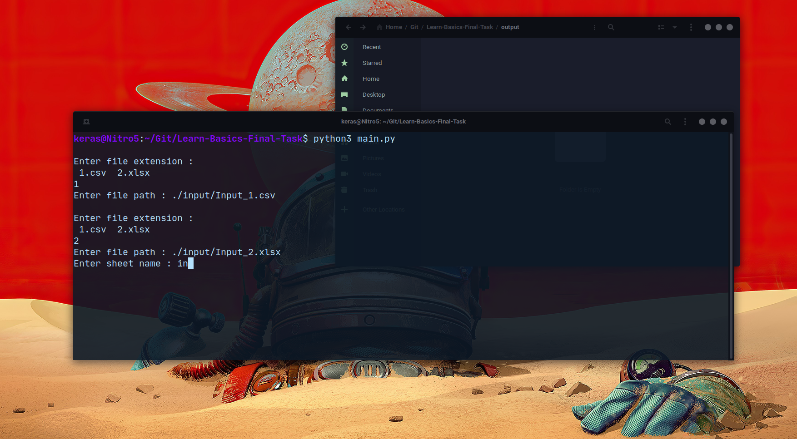
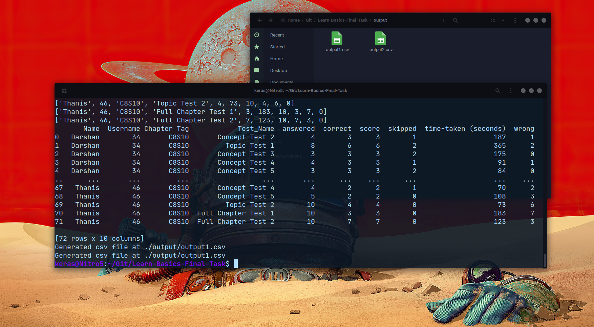

# Learn-Basics-Final-Task
This is the final python assessment from Learn-Basics.

**Done by Aditya Kiran Pal** || **Gmail :** adityakiran.cs@gmail.com 

### Problem Statement : 

Given a csv or xlsx file like [input](https://learnbasicsfun-my.sharepoint.com/:x:/g/personal/saran_learnbasics_fun/EWVde3y0mgFDqak-3f9sfwEBJDWEHCjEZ6h7j_HqLICvcw?e=gvGVVA), format the csv file according to this [output file](https://learnbasicsfun-my.sharepoint.com/:x:/g/personal/saran_learnbasics_fun/EYzUTOhjve9PjTLEBmvJm80BkcubyfbD9ulscGNxgFMT9w?e=eyxsdb). 

**Test parameters:** Answered, correct, score, skipped, timetaken, wrong

**Test Names:** Concept Test 1, Topic Test 2, Full Chapter Test 1

The test parameters repeat for every test so they are maintained in separate columns on output file. Remove those tests whose parameters are empty.

---
## Solution :
Wrote a python program to generate the required output CSV file.
Libraries Used : Pandas
Dependencies : openpyxl (Required for working with xlsx file)

### To get started :
1. Install pandas and openpyxl by entering the following commands in terminal/Powershell :
`pip install pandas openpyxl` or `pip3 install pandas openpyxl`

2. Once installed, clone this repository by entering the following command :
`git clone https://github.com/Keraskp/Learn-Basics-Final-Task.git`
You may download the main.py file only. Make sure you have a folder name `output` in the same directory.

3. Open the cloned repository and run main.py :
`python3 main.py` or `python main.py`

Enter choice and file path as shown in the image. **Note :** The image is taken on Ubuntu. Enter file path accordingly. Finally, created files should appear in the output folder.

To see the implementation of the program : You can view my [Jupyter Notebook](https://github.com/Keraskp/Learn-Basics-Final-Task/blob/main/Final%20Task.ipynb)
